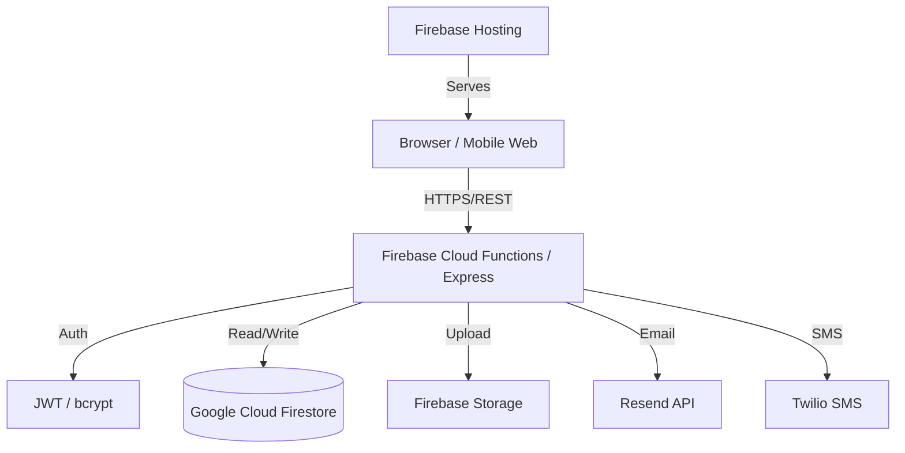
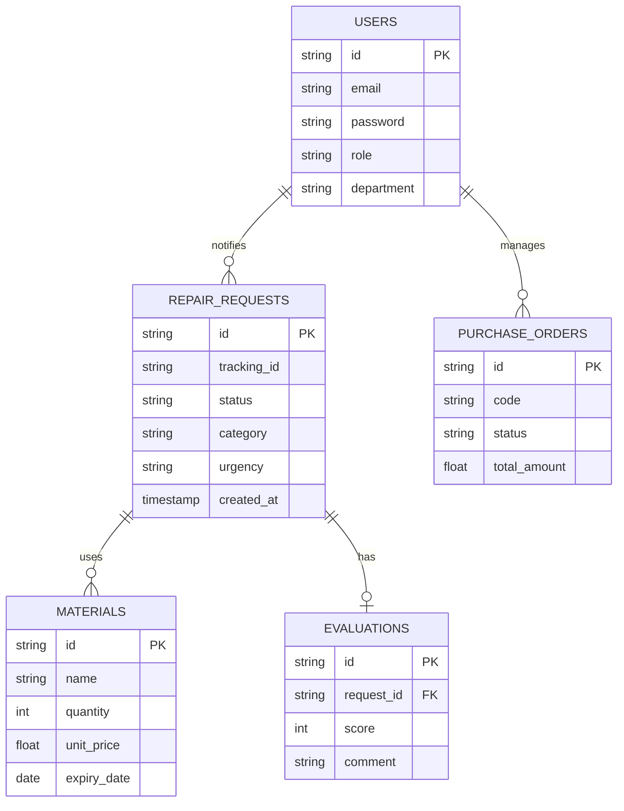

# 🔧 ระบบแจ้งซ่อมในสถานศึกษา (Maintenance Management System)
## SDDI Project - Version 2025

ระบบบริหารจัดการงานซ่อมบำรุงสำหรับสถานศึกษาแบบครบวงจร ครอบคลุมตั้งแต่การแจ้งซ่อม, การติดตามสถานะ, การจัดการวัสดุอุปกรณ์, ไปจนถึงการออกรายงานสถิติ เพื่อประสิทธิภาพสูงสุดในการดูแลรักษาสิ่งอำนวยความสะดวก

---

## 1. ข้อมูลทางด้านเทคนิค (Technical Overview)

### 1.1 System Architecture 🏗️
ระบบถูกพัฒนาด้วยสถาปัตยกรรม **Serverless** บน Google Cloud Platform (Firebase) เพื่อความรวดเร็วในการขยายตัวและความปลอดภัยสูง



### 1.2 Use Case Diagram 👤
ระบบรองรับ 4 บทบาทหลักที่มีสิทธิ์การใช้งานแตกต่างกัน

```mermaid
useCaseDiagram
    actor "User" as U
    actor "Technician" as T
    actor "Manager" as M
    actor "Admin" as A

    package "ระบบแจ้งซ่อม" {
        usecase "แจ้งซ่อมใหม่ (Submit Request)" as UC1
        usecase "ติดตามสถานะ (Track Status)" as UC2
        usecase "ประเมินความพึงพอใจ (Evaluate)" as UC3
        usecase "อัปเดตงานซ่อม (Fix & Update)" as UC4
        usecase "เบิกวัสดุอุปกรณ์ (Withdraw Materials)" as UC5
        usecase "มอบหมายงาน (Assign Task)" as UC6
        usecase "จัดการใบจัดซื้อ (PO Management)" as UC7
        usecase "ดูรายงานสรุป (Dashboard & Reports)" as UC8
        usecase "จัดการผู้ใช้และสิทธิ์ (User Mgmt)" as UC9
    }

    U --> UC1
    U --> UC2
    U --> UC3
    
    T --> UC4
    T --> UC5
    T --> UC2
    
    M --> UC6
    M --> UC7
    M --> UC8
    
    A --> UC9
    A --> UC8
    A --> UC6
```

### 1.3 Activity Diagram (Repair Workflow) ⚙️
กระบวนการทำงานตั้งแต่เริ่มจนจบงานซ่อม

```mermaid
activityDiagram
    start
    :User: แจ้งซ่อมผ่านระบบ;
    :System: ส่ง Notification หา Manager;
    if (เปิด Auto-Assign?) then (ใช่)
        :System: มอบหมายช่างที่มีงานน้อยที่สุดอัตโนมัติ;
    else (ไม่)
        :Manager: มอบหมายงานให้ช่างด้วยตนเอง;
    endif
    :Technician: รับงานและเริ่มดำเนินการ;
    :Technician: เบิกวัสดุจากคลัง (ถ้ามี);
    :Technician: อัปเดตรูปถ่าย (ก่อน/หลัง) และสถานะ;
    :System: แจ้งเตือน User เมื่อเสร็จสิ้น;
    :User: ประเมินความพึงพอใจ;
    stop
```

### 1.4 ER Diagram (Database Schema) 📊
โครงสร้างข้อมูลบน **NoSQL Firestore**



---

## 2. ประสบการณ์ผู้ใช้ (UX/UI) & การออกแบบ

### 2.1 User Flow
1. **Login:** เลือก Dashboard ตามบทบาท
2. **Action:** แจ้งซ่อม (User) / ทำงาน (Tech) / อนุมัติ (Manager)
3. **Finish:** ปิดงานพร้อมหลักฐานรูปภาพและตัดสต็อกวัสดุอัตโนมัติ

### 2.2 UX/UI Principles
- **Dark Mode Aesthetic:** ใช้โทนสีมืด (Deep Blue & Graphite) เพื่อลดความเมื่อยล้าทางสายตาและดูพรีเมียม
- **Glassmorphism:** ใช้เอฟเฟกต์ความโปร่งใสและ Blur ใน Cards และ Modals
- **Micro-Animations:** มี Feedback เมื่อกดปุ่มหรือเปลี่ยนสถานะ
- **Responsive Web Design:** รองรับ Mobile Web สำหรับช่างที่ต้องทำงานหน้างาน

### 2.3 API Endpoints (Core)
| Method | Endpoint | Description | Auth |
|---|---|---|---|
| POST | `/api/auth/login` | เข้าสู่ระบบ | No |
| POST | `/api/requests` | แจ้งซ่อมใหม่ | User |
| PATCH | `/api/requests/:id/assign` | มอบหมายช่าง | Manager |
| PATCH | `/api/requests/:id/status` | อัปเดตสถานะงาน | Tech |
| GET | `/api/reports/summary` | สรุปข้อมูลสถิติ | Manager |

---

## 3. Stack & Tools ✨

- **Frontend:** HTML5, CSS3 (Vanilla), JavaScript ES6+
- **Backend:** Node.js, Express.js
- **Compute:** Firebase Cloud Functions (v2)
- **Database:** Google Firestore (Serverless NoSQL)
- **Files:** Firebase Storage (Media Evidence)
- **Communication:** Resend (Email), Twilio (SMS Notification)
- **Security:** bcrypt (Password Hashing), JWT (Stateless Auth)
- **Testing:** Newman (Postman CLI), manual test cases

---

## 4. การทดสอบและรายงาน (Testing) 🧪

### 4.1 Test Cases (Sample)
| ID | Title | Expected Result | Status |
|---|---|---|---|
| TC-01 | สร้างใบแจ้งซ่อม | ระบบต้องออก Tracking ID และส่งเมล์หาผู้แจ้ง | ✅ Pass |
| TC-02 | เบิกวัสดุเกินสต็อก | ระบบต้องแจ้งเตือนและไม่อนุญาตให้เบิก | ✅ Pass |
| TC-03 | มอบหมายงานอัตโนมัติ | ระบบต้องเลือกช่างที่งานน้อยที่สุดในตอนนั้น | ✅ Pass |
| TC-04 | แจ้งเตือนฉุกเฉิน | ระบบต้องส่ง SMS หา Manager ทันที | ✅ Pass |

### 4.2 API Testing
เราใช้ **Postman** ในการรัน Integration Test สำหรับ API ทั้งหมด 25+ Endpoints เพื่อให้มั่นใจว่าระบบทำงานประสานกันได้ไร้รอยต่อ

---

## 5. การติดตั้งและ Deploy (Deployment) 🚀

1. **Prerequisites:** `npm install -g firebase-tools`
2. **Environment:** สร้างไฟล์ `.env` ในโฟลเดอร์ `backend` พร้อม API Keys
3. **Local Dev:**
   - Frontend: `npx live-server public`
   - Backend: `firebase emulators:start`
4. **Production Deploy:**
   ```bash
   firebase deploy --only hosting,functions
   ```

---
> [!NOTE]
> ระบบนี้ถูกออกแบบมาเพื่อรองรับผู้ใช้พร้อมกันสูงสุด 200 คน (Concurrent) โดยมีการทำ Rate Limiting เพื่อป้องกันการยิง API เกินความจำเป็น
